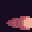

# 🔥 Dungeon Survivors

Пиксельный данжен-saveживальщик (survivor-like) на **Godot 4.3**.
Выживи 10 минут в подземелье, качай пироманта, жги скелетов!

## ▶️ Запуск
1. Скачай и распакуй архив релиза.
2. Открой **Godot 4.3** → Import → выбери `project.godot` → Run (F5).

## 🎮 Управление
| Клавиша | Действие |
|---|---|
| WASD / Стрелки | Движение |
| (авто) | Атаки сами летят в ближайших врагов |
| 1 / 2 / 3 или ЛКМ | Выбор улучшения при повышении уровня |
| R | Рестарт после смерти |
| Enter | Продолжить после победы |

## 🕹️ Что внутри
- **5 видов врагов**: скелет-мечник, гоблин, летучий череп, скелет-воин, вампир (стреляет сферами!)
- **2 босса** по расписанию (Демон с залпом комет, Кровавая тварь с рывком)
- **Прокачка**: 8 улучшений — скорострельность, урон (огонь меняет цвет: золото→синее→фиолет→красное пламя!), мультивыстрел, полумесяц, скорость, HP, магнит, реген
- **Лут**: монеты-опыт, флаконы здоровья, сундуки с монетным взрывом
- **Ловушки-шипы**, факелы, ящики — живая арена
- **Ранг A–S** по итогам забега + экран победы
- Элитные враги после 4-й минуты, «кольца теней» каждые ~40 сек, режим ва-банк после победы

## 📦 Ассеты (все бесплатные, itch.io)
| Пак | Автор |
|---|---|
| 2D Pixel Dungeon Asset Pack v2.0 | pixel_poem |
| Super Pixel Effects Gigapack (Free) | **unTied Games / Will Tice** — лицензия требует атрибуции |
| All Fire Bullet Pixel 16x16 | BDragon1727 |
| Tiny RPG Character Asset Pack 02 | Penzilla |
| Enemy Animations Set | автор указан на странице пака |

> При публикации игры проверь страницы паков на itch.io и укажи авторов в титрах.
