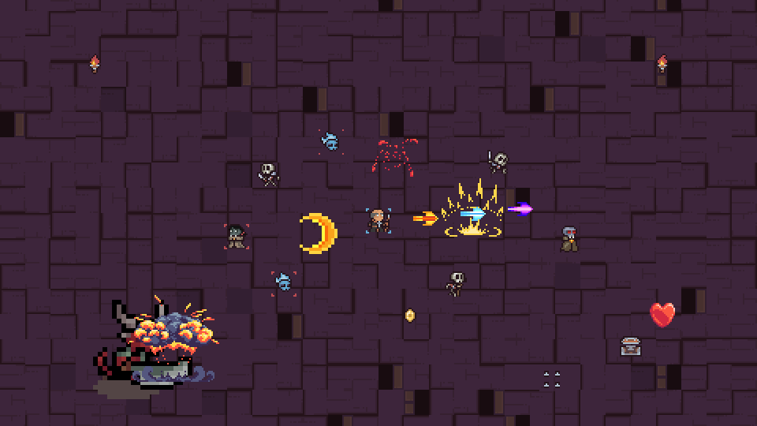

# 🔥 Dungeon Survivors (проект игры)

Пиксельный данжен-survivor на **Godot 4.3** (рендер: GL Compatibility).
Выживи 10 минут в подземелье!

## ▶️ Запуск
1. **Godot 4.3** → Import → выбери `project.godot` из этой папки → Run (F5).

## 🎮 Управление
| Клавиша | Действие |
|---|---|
| WASD / Стрелки | Движение |
| (авто) | Атаки сами летят в ближайших врагов |
| 1 / 2 / 3 или ЛКМ | Выбор улучшения при повышении уровня |
| R | Рестарт после смерти |
| Enter | Продолжить после победы |

## 🕹️ Состав
- 5 видов врагов + 2 босса по расписанию
- 8 улучшений (цвет огня меняется с уроном: золото → … → красное)
- Лут: монеты, 4 флакона, ключи, сундуки/мини-сундуки; шипы-ловушки; элитки; «кольца теней»
- Своя карта прямо в редакторе: второй TileMap-слой оживляет нарисованные
  монеты/флаконы/ключи/факелы, точки спавна маркерами — см. `TUTORIAL_MAP.md`
- Цифры урона/лечения, ранг A–S и экран победы

## 📦 Ассеты
Использованы бесплатные паки (см. файл ASSETS_REPORT.md в репозитории):
pixel_poem (данжен), unTied Games (эффекты, требуется атрибуция),
BDragon1727 (огонь), Penzilla (RPG-персонажи), Enemy Animations Set.
